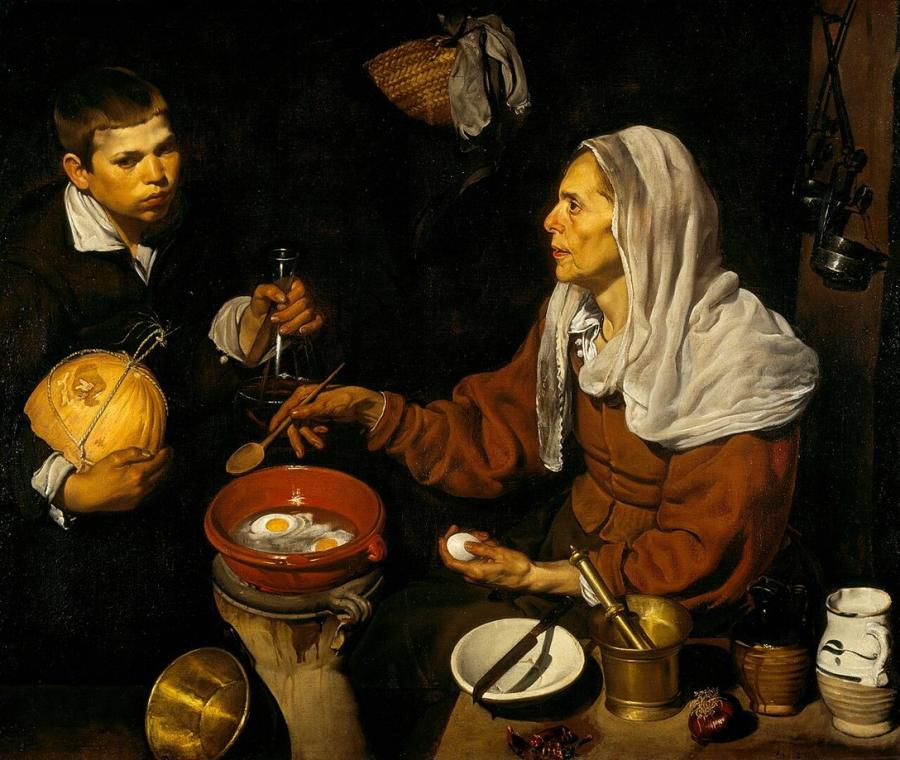
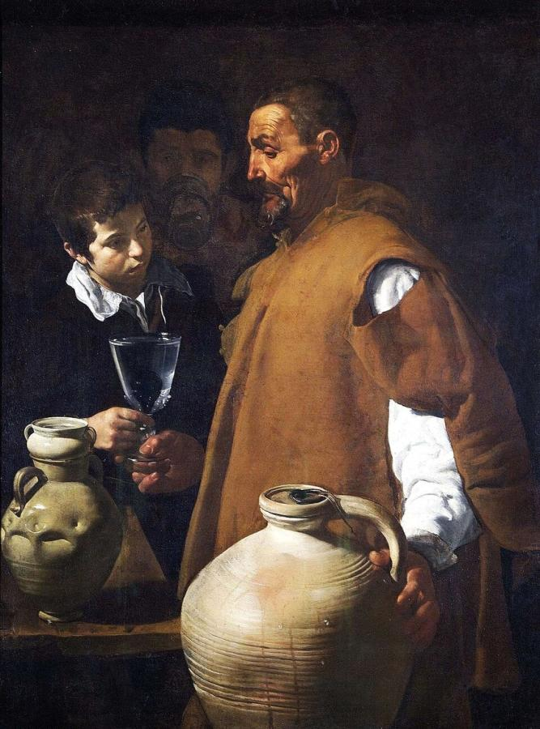
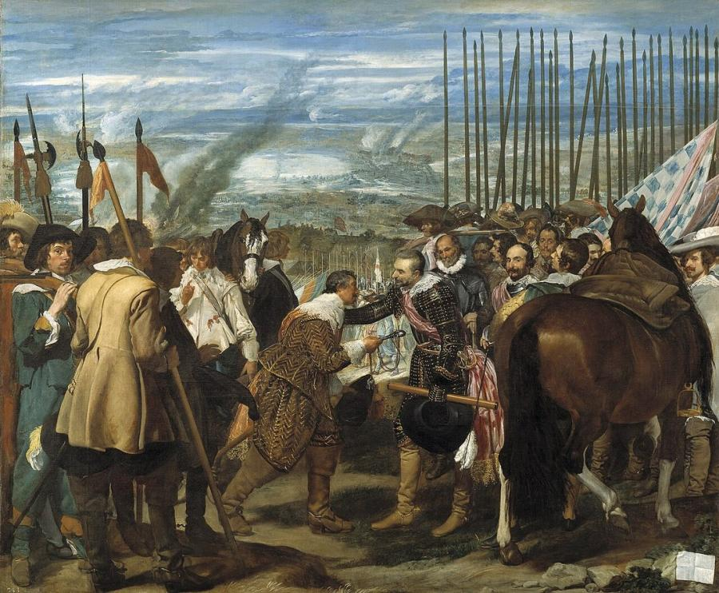
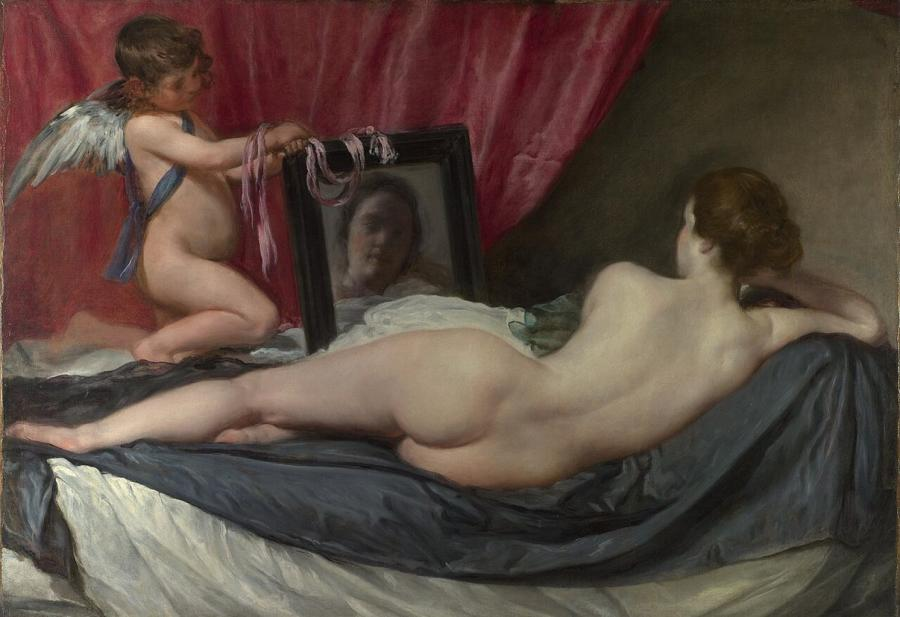
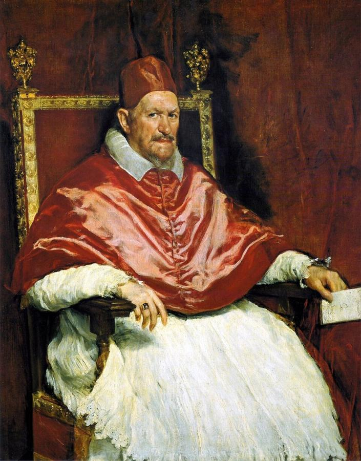
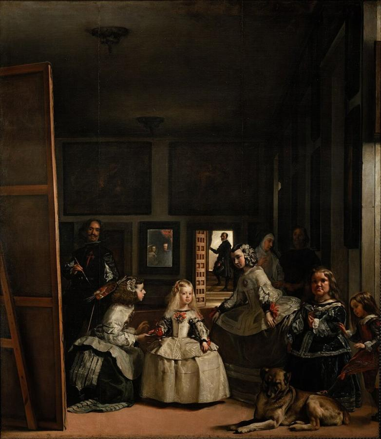

# Diego Velázquez (1599–1660)

> The leading painter of Spain's Golden Age, whose loose, luminous brushwork and truthful portraits of kings and commoners made him a "painter's painter".

## Overview

Diego Velázquez spent most of his career as court painter to King Philip IV of Spain. He painted the
royal family, courtiers, jesters and dwarfs with the same unflinching honesty. Seen up close, his
brushwork breaks into loose, almost abstract dabs; from a distance it resolves into shimmering silk
and living flesh. *Las Meninas* is often called the greatest painting ever made. Manet called
Velázquez "the painter of painters", and his influence runs through Goya, the Impressionists and
Picasso.

## Life

Velázquez was baptised in Seville on 6 June 1599. At about 11 he entered the workshop of Francisco
Pacheco, a painter and scholar, and in 1618 he married Pacheco's daughter Juana. In Seville he painted
*bodegones*, kitchen scenes with still lifes, and religious works in a strongly lit, naturalistic
style influenced by Caravaggio.

In 1623 he painted a portrait of the young Philip IV that so pleased the king that Velázquez was
appointed court painter, and he moved to Madrid. He would serve Philip for 37 years, rising through
court offices to become chamberlain of the palace. In 1628 he met Peter Paul Rubens, then on a
diplomatic mission to Madrid, who encouraged him to visit Italy. His first Italian trip (1629–1631)
transformed his colour and handling.

A second journey to Italy (1649–1651) to buy art for the royal collection produced his portraits of
Pope Innocent X and of his assistant Juan de Pareja. Back in Madrid he painted *Las Meninas* (1656). In
1659 he was admitted to the noble Order of Santiago, a rare honour for a painter. He died on 6 August
1660, shortly after organising the ceremonies for the marriage of the Infanta Maria Theresa to Louis
XIV of France.

## Style & Technique

Early Velázquez is sharp, dark and sculptural. After studying Titian and the Venetians in Italy, his
style loosened into thin layers of paint and quick, suggestive strokes. He painted *alla prima*,
directly and often without drawing, and he altered compositions on the canvas; X-rays reveal many
changes of mind. His palette was restrained, built on greys, blacks and earth tones, which makes his
occasional reds and pinks glow.

He was a master of air and space. In *Las Meninas* the room seems to fill with light and atmosphere.
His portraits avoid flattery: the king's heavy Habsburg jaw, the court dwarfs' dignity and intelligence,
the pope's wary eyes are all recorded truthfully.

## Legacy

Velázquez's work was largely locked away in Spanish royal palaces until the Prado opened in 1819.
When 19th-century artists saw it, they were overwhelmed. Manet travelled to Madrid in 1865 and
declared him the greatest painter who ever lived. Whistler and Sargent learned from his tonal
harmonies. In the 20th century Picasso painted 58 variations on *Las Meninas* (1957), and Francis
Bacon's screaming popes are based on his *Innocent X*. Salvador Dalí's moustache was a homage to him.

## Key Works

<!-- works:start -->

### 1. Old Woman Frying Eggs (1618)

*Oil on canvas, 100.5 × 119.5 cm · Scottish National Gallery, Edinburgh*

Painted in Seville when Velázquez was about 19, this *bodegón*, a kitchen scene with still life, shows an old woman cooking eggs in a clay dish while a boy brings a melon and a flask. The eggs turning white in the oil, the gleam on a brass mortar and the shadows under a knife are all observed with astonishing precision for so young a painter.

Image: [Wikimedia Commons](https://commons.wikimedia.org/wiki/File:Diego_Velazquez_-_An_Old_Woman_Cooking_Eggs_-_Google_Art_Project.jpg) · Diego Velázquez · Public domain

### 2. The Waterseller of Seville (c. 1618–1622)

*Oil on canvas, 106.7 × 81 cm · Apsley House (Wellington Collection), London*

A dignified old water-seller hands a glass to a boy, while a man drinks in the shadows behind. A fig floats in the glass to freshen the water, and drops bead on the great clay jug. Velázquez gives a street vendor the gravity of a saint. The painting was captured from Joseph Bonaparte's baggage after the Battle of Vitoria in 1813 and given to the Duke of Wellington.

Image: [Wikimedia Commons](https://commons.wikimedia.org/wiki/File:El_aguador_de_Sevilla,_por_Diego_Vel%C3%A1zquez.jpg) · Diego Velázquez · Public domain

### 3. The Surrender of Breda (1634–1635)

*Oil on canvas, 307 × 367 cm · Museo del Prado, Madrid*

Painted for the Hall of Realms in the Buen Retiro Palace, it commemorates a Spanish victory of 1625 in the war with the Dutch. Instead of triumph, Velázquez shows courtesy: the Spanish general Ambrogio Spinola lays a consoling hand on the shoulder of the defeated Justinus of Nassau as he hands over the city's keys. Behind the Spanish, a forest of upright lances gave the painting its popular name, *Las Lanzas*.

Image: [Wikimedia Commons](https://commons.wikimedia.org/wiki/File:Velazquez-The_Surrender_of_Breda.jpg) · Diego Velázquez · Public domain

### 4. The Rokeby Venus (The Toilet of Venus) (1647–1651)

*Oil on canvas, 122.5 × 177 cm · National Gallery, London*

The only surviving female nude by Velázquez, a rare subject in Catholic Spain. Venus reclines with her back to us, gazing into a mirror held by Cupid, where her face appears as a soft blur. In 1914 the suffragette Mary Richardson slashed the canvas with a meat cleaver in protest at the arrest of Emmeline Pankhurst. It was skilfully restored.

Image: [Wikimedia Commons](https://commons.wikimedia.org/wiki/File:Diego_Vel%C3%A1zquez_-_Rokeby_Venus.jpg) · Diego Velázquez · Public domain

### 5. Portrait of Pope Innocent X (c. 1650)

*Oil on canvas, 141 × 119 cm · Galleria Doria Pamphilj, Rome*

Painted during Velázquez's second trip to Italy, this portrait shows the 75-year-old pope in shimmering red and white, his sharp, suspicious gaze fixed on the viewer. Innocent is said to have remarked that it was *troppo vero*, "too true". Three centuries later it obsessed Francis Bacon, who painted dozens of screaming variations on it.

Image: [Wikimedia Commons](https://commons.wikimedia.org/wiki/File:Retrato_del_Papa_Inocencio_X._Roma,_by_Diego_Vel%C3%A1zquez.jpg) · Diego Velázquez · Public domain

### 6. Las Meninas (1656)

*Oil on canvas, 318 × 276 cm · Museo del Prado, Madrid*

The little Infanta Margarita stands among her maids of honour, a dwarf, a dog and courtiers. At the left Velázquez himself stands at a vast canvas, brush poised. In a mirror on the back wall appear the king and queen, standing, it seems, exactly where we stand. Who is looking at whom? The picture's puzzles about seeing and representation have made it perhaps the most analysed painting in Western art.

Image: [Wikimedia Commons](https://commons.wikimedia.org/wiki/File:Las_Meninas,_by_Diego_Vel%C3%A1zquez,_from_Prado_in_Google_Earth.jpg) · Diego Velázquez · Public domain

<!-- works:end -->
## Sources

- [Diego Velázquez (Wikipedia)](https://en.wikipedia.org/wiki/Diego_Vel%C3%A1zquez)
- [Las Meninas (Wikipedia)](https://en.wikipedia.org/wiki/Las_Meninas)
- [Rokeby Venus (Wikipedia)](https://en.wikipedia.org/wiki/Rokeby_Venus)
