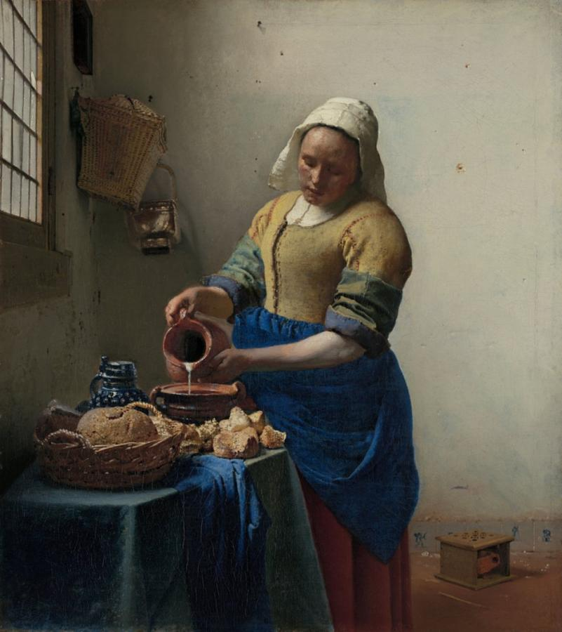
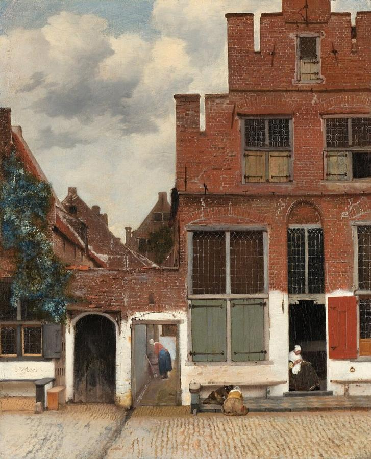
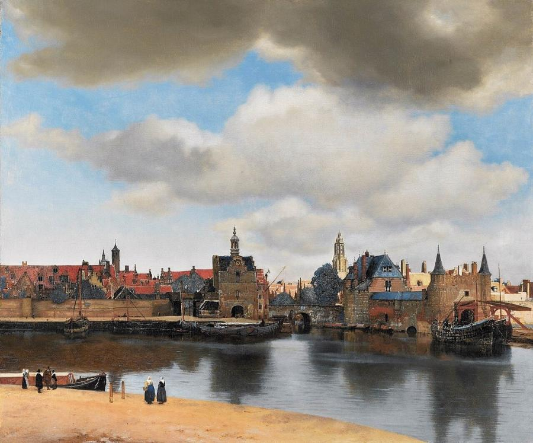
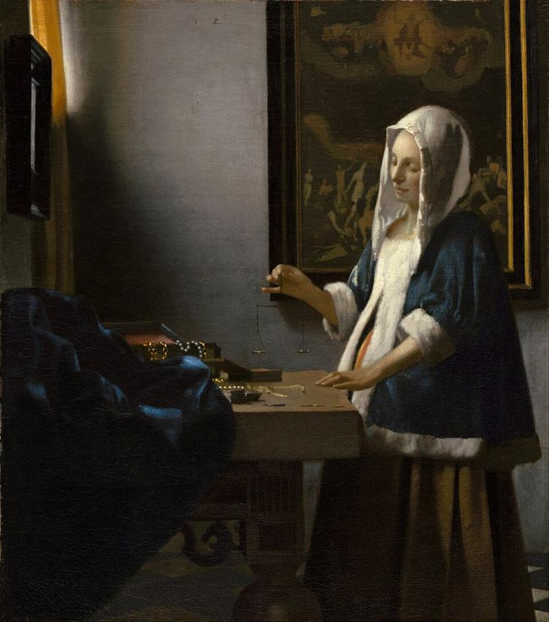
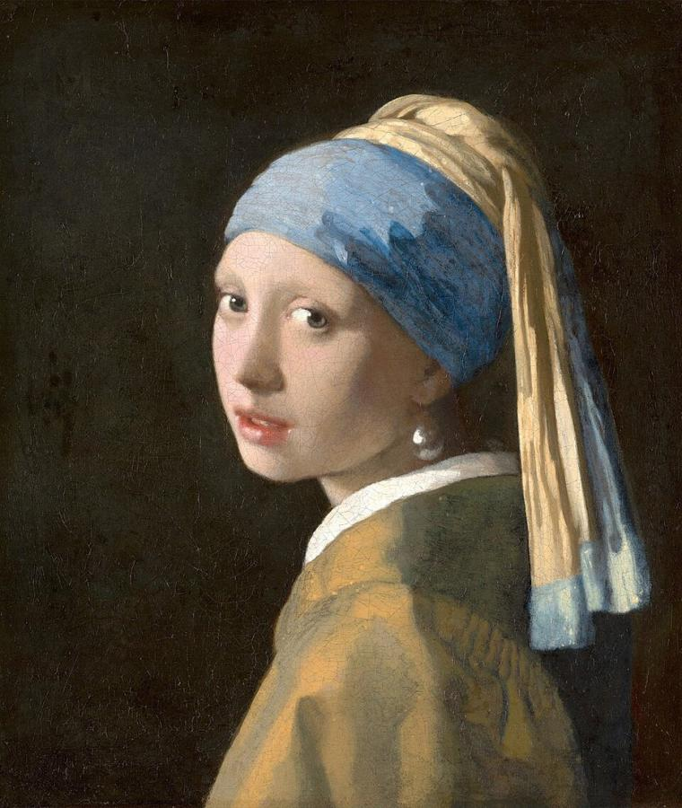
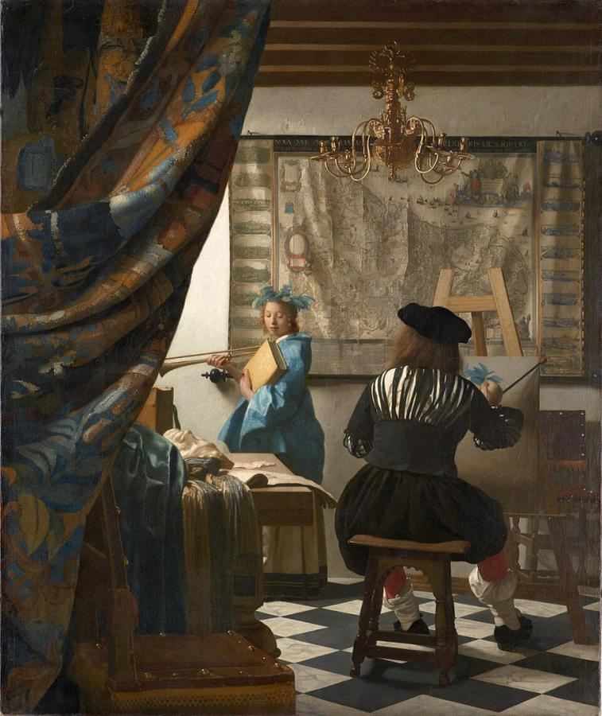

# Johannes Vermeer (1632–1675)

> The Delft painter of quiet interiors and luminous light, whose small output of about 35 paintings contains some of the most beloved images in art.

## Overview

Johannes Vermeer painted slowly and sparingly: only about 35 paintings are accepted as his. Most show
one or two figures in a room in Delft, lit by soft daylight from a window at the left. A woman reads a
letter, pours milk, plays a keyboard, weighs pearls. In these calm, closely observed scenes he achieved
a purity of light and colour, especially his costly ultramarine blue, that few have ever matched.
Almost forgotten for 200 years after his death, he is now among the most famous painters in the world.

## Life

Vermeer was baptised in Delft on 31 October 1632. His father was a silk weaver who also dealt in art
and ran an inn on the market square. Nothing is known of Vermeer's training. In 1653 he married
Catharina Bolnes, a Catholic from a wealthier family, and probably converted to her faith. The same
year he joined Delft's Guild of St Luke, which later elected him as one of its leaders several times.

The couple lived with Catharina's mother, Maria Thins, in a house in the Catholic quarter of Delft,
and had 15 children, 11 of whom survived. Vermeer worked as an art dealer as well as a painter, and
his slow output was bought largely by a single local patron, Pieter van Ruijven.

In 1672, the Dutch Republic's "Disaster Year", France invaded and the art market collapsed. Vermeer
could sell neither his own paintings nor others'. His widow wrote that the strain drove him into a
frenzy, and within a day or two he was dead. He was buried in December 1675, aged 43, leaving his
family deep in debt.

## Style & Technique

Vermeer built his pictures carefully, with geometric compositions and a limited cast of props: maps,
chairs with lion-head finials, Turkish carpets, pearls. He used expensive pigments freely, above all
natural ultramarine ground from lapis lazuli, even in shadows. He applied small dots of thick paint
(*pointillés*) to suggest sparkling highlights.

Some features of his paintings, such as blurred foregrounds and highlights like those of an
out-of-focus lens, have led scholars to argue that he used a camera obscura as an aid. The question
remains debated. What is certain is his sensitivity to how daylight falls, softens and reflects
through a room.

## Legacy

After his death Vermeer's name faded; some of his works were sold as by other artists. In the 1860s
the French critic Théophile Thoré-Bürger rediscovered him and called him the "Sphinx of Delft". His
rarity and fame made him a target for forgers: in the 1940s Han van Meegeren fooled experts, and sold
a fake Vermeer to Hermann Göring. A record-breaking exhibition of 28 of his works at the Rijksmuseum
in 2023 sold out within days. Tracy Chevalier's novel *Girl with a Pearl Earring* (1999) and its film
adaptation brought his world to millions.

## Key Works

<!-- works:start -->

### 1. The Milkmaid (c. 1657–1658)

*Oil on canvas, 45.5 × 41 cm · Rijksmuseum, Amsterdam*

A sturdy kitchen maid pours a thin stream of milk into an earthenware bowl, utterly absorbed in her work. Light from the window picks out the crusty bread in dots of paint, the nail holes in the plaster wall, and the ultramarine of her apron. Vermeer makes a simple household task feel timeless and quietly heroic.

Image: [Wikimedia Commons](https://commons.wikimedia.org/wiki/File:Johannes_Vermeer_-_Het_melkmeisje_-_Google_Art_Project.png) · Johannes Vermeer · Public domain

### 2. The Little Street (c. 1657–1658)

*Oil on canvas, 54.3 × 44 cm · Rijksmuseum, Amsterdam*

A view of ordinary brick houses in Delft, with a woman sewing in a doorway, another busy in an alleyway, and children playing on the pavement. Every crack and patch of whitewash is lovingly recorded. In 2015 archival research identified the exact site, on the Vlamingstraat, where Vermeer's aunt lived.

Image: [Wikimedia Commons](https://commons.wikimedia.org/wiki/File:Johannes_Vermeer_-_Gezicht_op_huizen_in_Delft,_bekend_als_%27Het_straatje%27_-_Google_Art_Project.jpg) · Johannes Vermeer · Public domain

### 3. View of Delft (c. 1660–1661)

*Oil on canvas, 96.5 × 115.7 cm · Mauritshuis, The Hague*

Vermeer's hometown seen across the water on a morning after rain, under towering clouds. Parts of the city lie in shadow while sunlight strikes a distant church tower and rooftops. He mixed sand into some of his paint to catch the texture of brick and stone. In Proust's *In Search of Lost Time*, the writer Bergotte dies gazing at its "little patch of yellow wall".

Image: [Wikimedia Commons](https://commons.wikimedia.org/wiki/File:Vermeer-view-of-delft.jpg) · Johannes Vermeer · Public domain

### 4. Woman Holding a Balance (c. 1662–1663)

*Oil on canvas, 39.7 × 35.5 cm · National Gallery of Art, Washington*

A woman in a fur-trimmed jacket stands at a table strewn with pearls and gold, holding a small, empty balance up to the soft window light. On the wall behind her hangs a painting of the Last Judgment, when souls are weighed. The picture is a meditation on balance, temperance and the choices of daily life.

Image: [Wikimedia Commons](https://commons.wikimedia.org/wiki/File:Johannes_Vermeer_-_Woman_Holding_a_Balance_-_Google_Art_Project.jpg) · Johannes Vermeer · Public domain

### 5. Girl with a Pearl Earring (c. 1665)

*Oil on canvas, 44.5 × 39 cm · Mauritshuis, The Hague*

Not a portrait but a *tronie*, a study of a character or type. A girl in an exotic blue and yellow turban turns over her shoulder toward us, lips parted, a large pearl gleaming at her ear. The pearl is just two strokes of paint. Often called the "Mona Lisa of the North", it inspired a best-selling novel and a 2003 film.

Image: [Wikimedia Commons](https://commons.wikimedia.org/wiki/File:1665_Girl_with_a_Pearl_Earring.jpg) · Johannes Vermeer · Public domain

### 6. The Art of Painting (c. 1666–1668)

*Oil on canvas, 120 × 100 cm · Kunsthistorisches Museum, Vienna*

A heavy tapestry is drawn back to reveal a painter, seen from behind, painting a model dressed as Clio, the muse of history, with a trumpet and a book. A large map of the Netherlands covers the back wall. Vermeer kept this allegory of his art until his death. In 1940 it was bought by Adolf Hitler; after the war it went to Vienna, and restitution claims for it were rejected in 2011.

Image: [Wikimedia Commons](https://commons.wikimedia.org/wiki/File:Jan_Vermeer_-_The_Art_of_Painting_-_Google_Art_Project.jpg) · Johannes Vermeer · Public domain

<!-- works:end -->
## Sources

- [Johannes Vermeer (Wikipedia)](https://en.wikipedia.org/wiki/Johannes_Vermeer)
- [Girl with a Pearl Earring (Wikipedia)](https://en.wikipedia.org/wiki/Girl_with_a_Pearl_Earring)
- [Essential Vermeer](http://www.essentialvermeer.com/)
