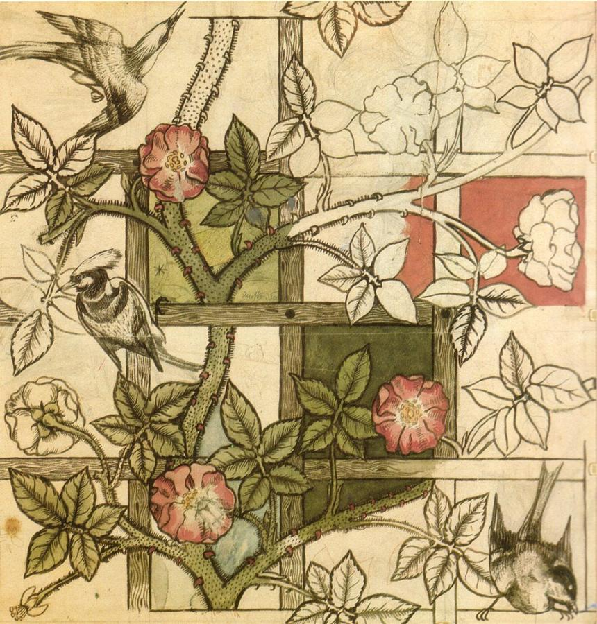
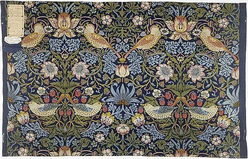
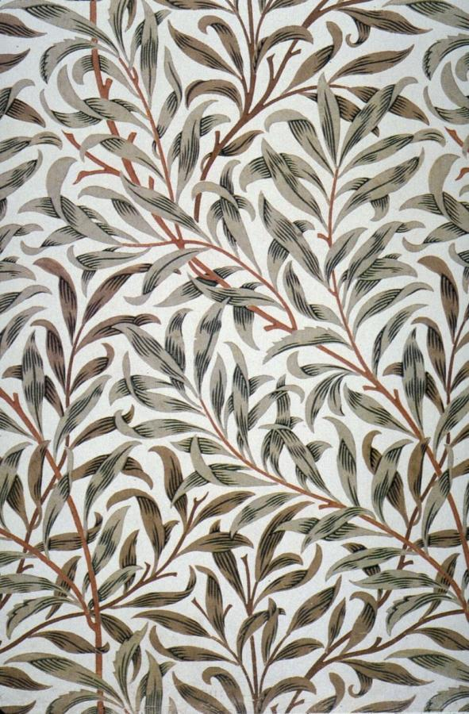
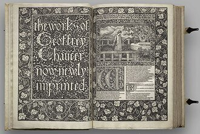

# William Morris (1834–1896)

> The founder of the Arts and Crafts movement, whose hand-crafted wallpapers, textiles and books argued that everyday objects should be both useful and beautiful.

## Overview

William Morris was the central figure of the Arts and Crafts movement, a designer, writer and
socialist who rejected the cheap, mechanised ornament of Victorian mass production in favour of
patterns drawn directly from close observation of the natural world and made by traditional,
labour-intensive craft methods. His wallpapers and textiles, many still in production today, made
his name as a decorative artist, while his final project, the Kelmscott Press, tried to bring the
same standard of craftsmanship to the printed book.

## Life

Morris was born in 1834 in Walthamstow, near London, into a family that had grown wealthy through a
Cornish copper mine. At Oxford he met the painter Edward Burne-Jones and, through him, the circle
around the Pre-Raphaelite painter Dante Gabriel Rossetti, whose rejection of academic convention
shaped his own aesthetic outlook. Unable to find furnishings he considered well made for his new
home, Red House, he founded a decorative arts firm in 1861 with Burne-Jones, Rossetti, the architect
Philip Webb and others, reorganised in 1875 as Morris & Co., producing wallpaper, textiles,
furniture, stained glass and carpets designed largely by Morris himself. He became an increasingly
committed socialist in his later years, founding the Socialist League in 1884 and writing extensively
on politics and utopian fiction alongside his design work. In 1891 he founded the Kelmscott Press,
and its climactic production, an illustrated edition of Chaucer, was completed only months before he
died in 1896.

## Style & Technique

Morris designed by studying real plants, willow, honeysuckle, acanthus, strawberry-thieving
thrushes, directly from nature and then disciplining them into dense, flattened, endlessly repeating
patterns suited to a printed roll or woven bolt of cloth. He insisted on reviving slow,
labour-intensive traditional techniques, hand block-printing and indigo-discharge dyeing for
textiles, letterpress printing from hand-cut type for books, over the faster industrial methods of
his day, on the belief that only hand craftsmanship could produce lasting quality and honest
beauty. His guiding principle, "have nothing in your house that you do not know to be useful or
believe to be beautiful," summarised a design philosophy he pursued, not without irony, in luxury
goods that only the wealthy could generally afford.

## Legacy

Morris's insistence on craftsmanship, honest materials and design rooted in nature became the
founding programme of the international Arts and Crafts movement and fed indirectly into Art
Nouveau and even the industrial-design thinking of the Bauhaus a generation later. Morris & Co.'s
wallpapers and textiles, including Strawberry Thief and Willow Bough, remain in commercial
production more than a century after his death. The Kelmscott Press, and the Chaucer above all,
launched the private-press movement that shaped serious book design throughout the twentieth
century.

## Key Works

<!-- works:start -->

### 1. Red House (1859–1860)

*Red brick, designed with architect Philip Webb · Bexleyheath, England*

Morris's own marital home, designed with his close friend, the architect Philip Webb, in plain red brick rather than the stucco and historical ornament fashionable at the time. Morris, Burne-Jones and their circle hand-decorated its interior with murals, furniture and embroidery, and its blend of medieval and vernacular English building traditions has been called the starting point of the Arts and Crafts movement.

Image: [Wikimedia Commons](https://commons.wikimedia.org/wiki/File:Philip_Webb%27s_Red_House_in_Upton.jpg) · Ethan Doyle White · [CC BY-SA 3.0](https://creativecommons.org/licenses/by-sa/3.0)

### 2. Trellis (1862)

*Block-printed wallpaper · Morris, Marshall, Faulkner & Co., London, England*

Morris's first wallpaper design, drawn directly from the rose trellis in the garden of his own Red House, with birds added by Philip Webb. Its dense, flattened pattern of climbing roses set the template for the repeating botanical designs that would define his work: closely observed nature disciplined into a workable, endlessly repeatable print block.

Image: [Wikimedia Commons](https://commons.wikimedia.org/wiki/File:William_Morris_design_for_Trellis_wallpaper_1862.jpg) · William Morris · Public domain

### 3. Strawberry Thief (1883)

*Indigo-discharge printed cotton textile · Merton Abbey Works, Surrey, England*

Named for the thrushes that stole fruit from Morris's own kitchen garden, this design took months to perfect using the indigo-discharge method, a slow, labour-intensive dyeing process Morris insisted on reviving over cheaper synthetic-dye printing because of the richer colour and permanence it gave. Still in production today, it remains one of the best-known textile patterns ever made.

Image: [Wikimedia Commons](https://commons.wikimedia.org/wiki/File:Strawberrythief.jpg) · The original uploader was VAwebteam at English Wikipedia . · Public domain

### 4. Willow Bough (1887)

*Block-printed wallpaper · Morris & Co., London, England*

A dense, interlocking pattern of willow leaves derived from trees Morris studied along the River Thames near his country home, Kelmscott Manor. Among the most technically demanding of his wallpapers to print, requiring numerous separate blocks, it remains one of his most widely reproduced designs.

Image: [Wikimedia Commons](https://commons.wikimedia.org/wiki/File:Morris_Willow_Bough_1887.jpg) · William Morris · Public domain

### 5. The Kelmscott Chaucer (1896)

*Letterpress printed book, Morris's own "Chaucer" typeface with illustrations by Edward Burne-Jones · Kelmscott Press, Hammersmith, England*

The masterpiece of the private press Morris founded in 1891 to revive medieval standards of book design against industrial mass printing: 87 woodcut illustrations by his lifelong friend Edward Burne-Jones, ornamental borders designed by Morris himself, and a typeface he cut based on 15th-century models. Finished only months before his death, it became the most influential book of the private-press movement that followed.

Image: [Wikimedia Commons](https://commons.wikimedia.org/wiki/File:KelmscottChaucerSpread.jpg) · Photo by Elif Ayiter. Book: William Morris and Edward Burne-Jones. · [CC BY 3.0](https://creativecommons.org/licenses/by/3.0)

<!-- works:end -->
## Sources

- [William Morris (Wikipedia)](https://en.wikipedia.org/wiki/William_Morris)
- [Strawberry Thief (Wikipedia)](https://en.wikipedia.org/wiki/Strawberry_Thief)
- [Kelmscott Press (Wikipedia)](https://en.wikipedia.org/wiki/Kelmscott_Press)
